<div align="center">
  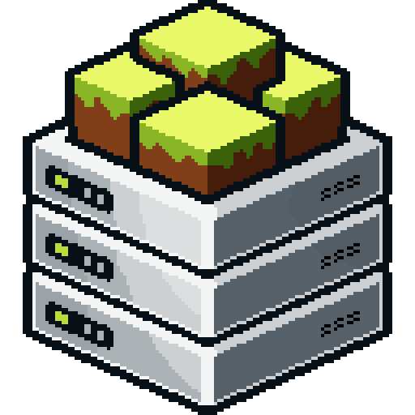

  # Craftbox

  <p style="margin-bottom:1rem;">A modern self-hosted platform for managing Minecraft servers with built-in mod support.</p>
</div>

<div align="center">


[](https://diamonddigital.dev/discord)
[](https://www.buymeacoffee.com/willtda)

</div>

> [!WARNING]
> **Craftbox is not stable yet and is under active development.** Do not migrate to Craftbox as your primary server management solution just yet! Beta updates may contain breaking changes or bugs that could cause corruption or data loss. If you find a bug, please submit a bug report in the [issues tab](https://github.com/diamonddigitaldev/Craftbox/issues).

## 🔎 Overview

**Craftbox** is a self-hosted web panel for creating, configuring, monitoring, and managing Minecraft servers — no command-line expertise or dodgy download pages required.

It ships as a single **Node.js / Express** application with a **Bootstrap 5** dark-theme UI, **WebSocket**-powered live console, and **SQLite** for zero-config persistence. Deploy it with Docker or run it standalone.

Whether you're running a single Vanilla server or juggling multiple modded instances, Craftbox gives you full control from your browser.


## ✨ Features

- 🖥️ **Multi-Server Management** — Run and manage multiple Minecraft servers from a single panel, each with its own console, watchdog, and configuration.
- 🧩 **Multi-Server-Type Support** — Vanilla, Paper, Purpur, Folia, Fabric, Forge, NeoForge, and custom JAR uploads.
- 📟 **Live Console** — Real-time server log streaming and command input via WebSocket.
- ⚙️ **Server Configuration UI** — Edit `server.properties`, JVM flags, memory allocation, game mode, difficulty, and more — all from the browser.
- 💾 **Backups** — One-click manual backups, scheduled backups with retention policies, and one-click restore.
- 🔌 **Plugin & Mod Management** — Upload and manage JAR files for plugins (Paper/Purpur/Folia) and mods (Fabric/Forge/NeoForge).
- 📋 **Server Duplication & Templates** — Clone a server with or without world data, or save configurations as reusable templates.
- 📊 **Status & Monitoring** — Public status pages, live player tracking, resource monitoring, and event history.
- 🛡️ **Crash Detection & Auto-Restart** — Watchdog detects crashes/runtime errors and optionally auto-restarts.
- 📱 **PWA Support** — Installable as a Progressive Web App on desktop and mobile.


## 📸 Screenshots

| Feature | Screenshot |
|---------|-----------|
| **Dashboard** — Overview of all your servers, their status, and quick actions. | 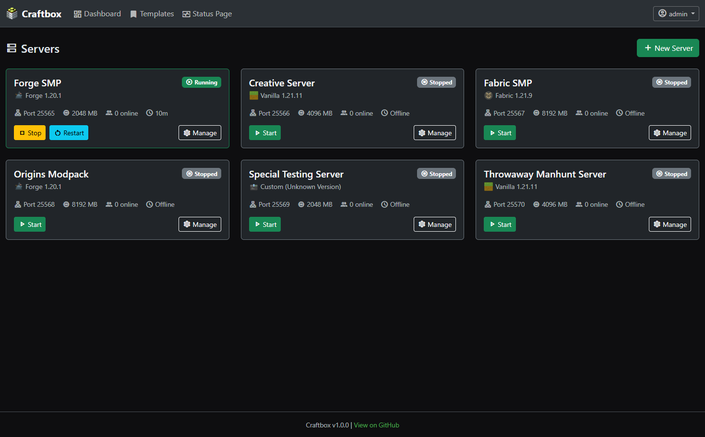 |
| **Create Server** — Set up a new server with type, version, and settings. | 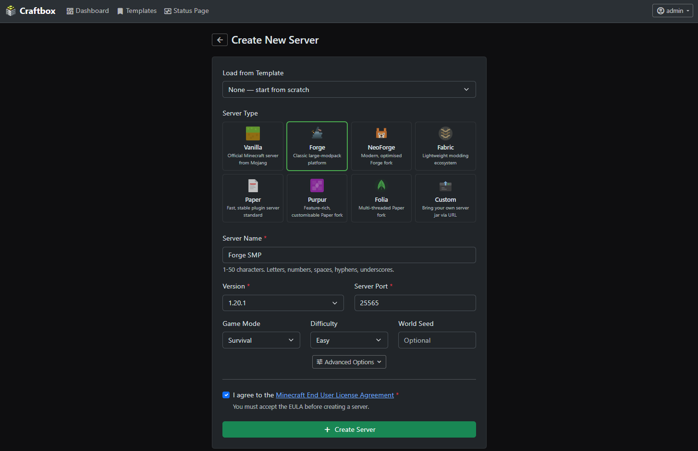 |
| **Console** — Real-time server logs and command input with live updates. | 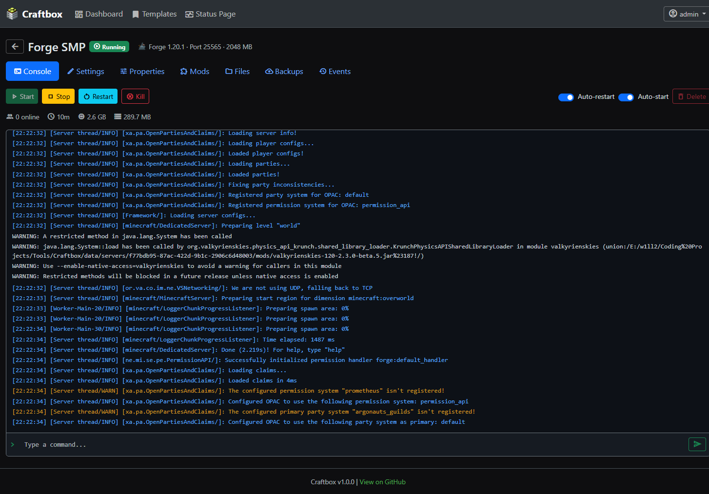 |
| **Settings** — Configure basic world settings, JVM flags, auto-restart, auto-start, and other server behaviors. | 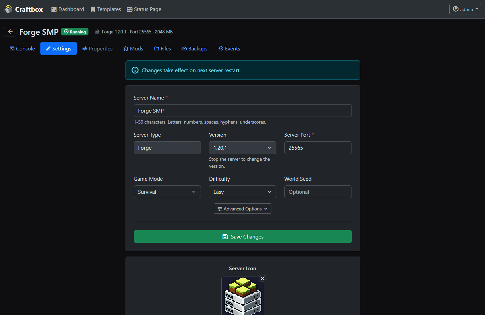 |
| **Server Properties** — Edit `server.properties` from the browser. | 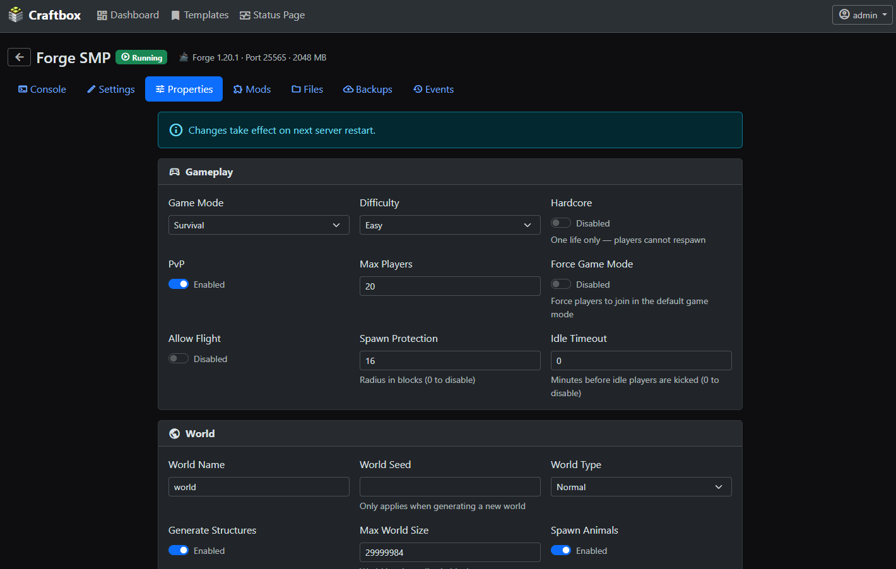 |
| **Plugin & Mod Manager** — Upload and manage plugins for Paper/Purpur or mods for Fabric/Forge/NeoForge. | 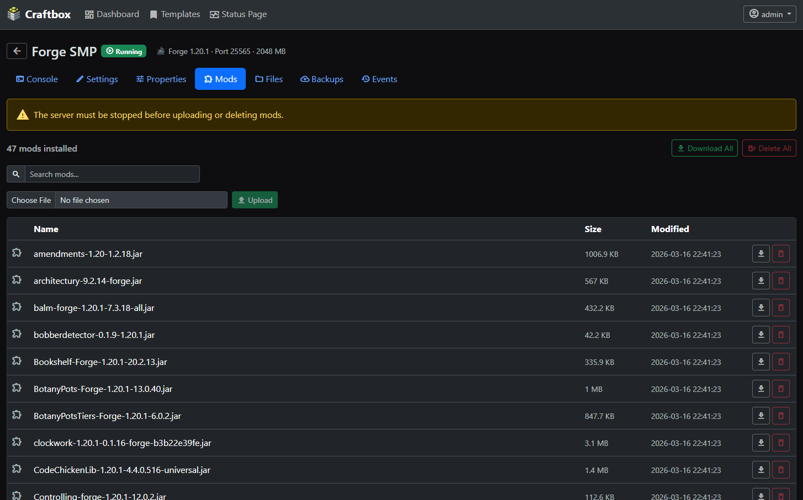 |
| **File Manager** — Browse and edit server files directly from the web panel. | 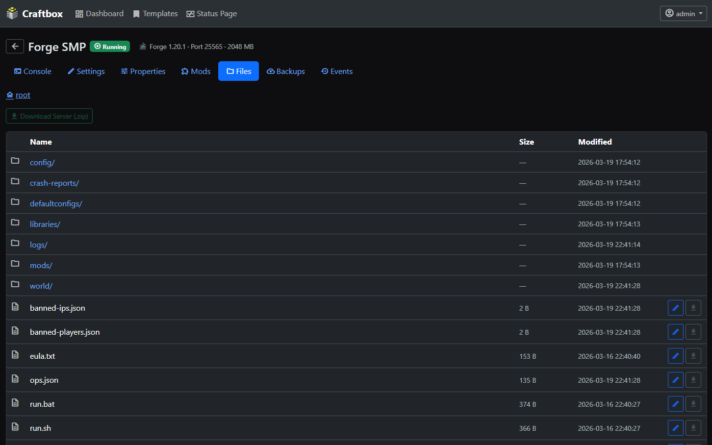 |
| **Backups** — Create, schedule, and restore backups with retention policies. | 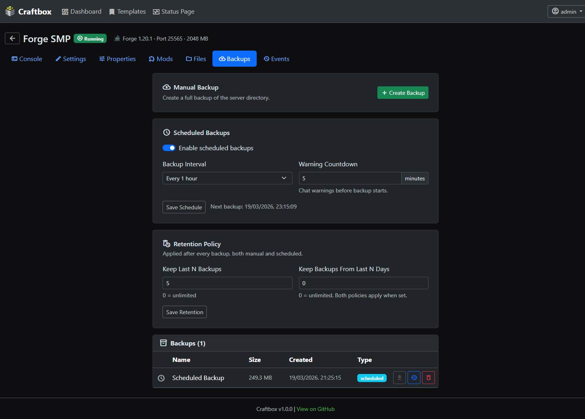 |
| **Event History** — Track player joins, crashes, restarts, and other events. | 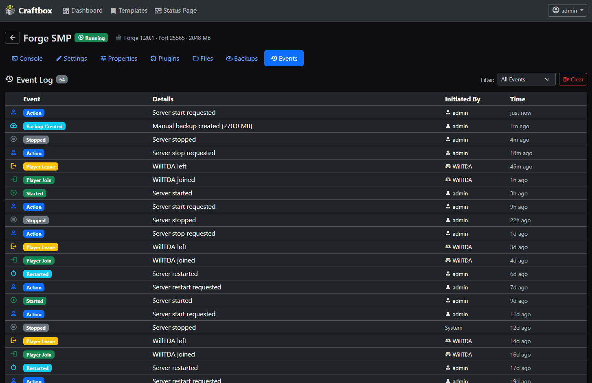 |
| **Public Status Page** — Share a read-only status page with your community. | 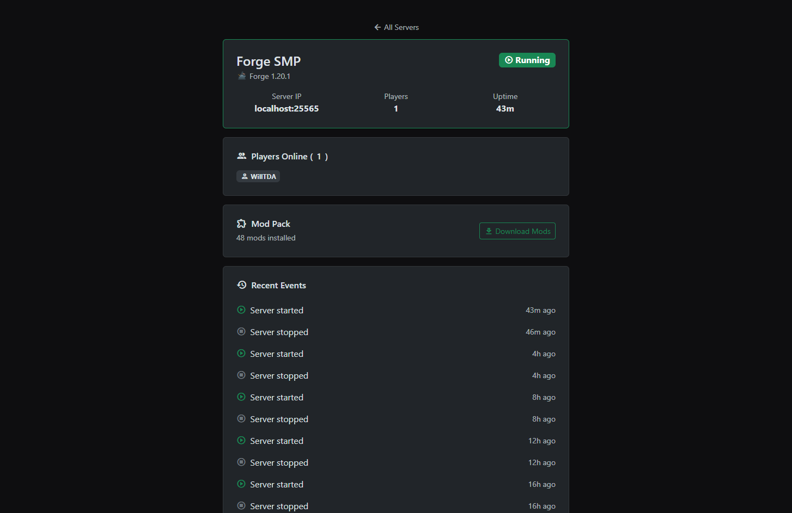 |
| **Server Templates** — Quickly create new servers based on existing configurations. | 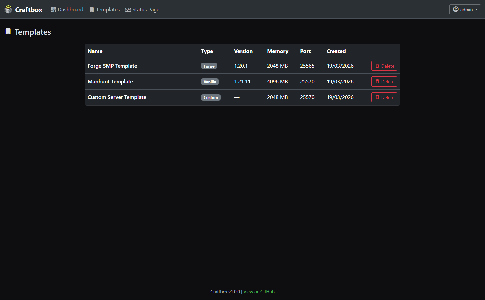 |


## 🧰 Getting Started

### Docker (Recommended)

A common problem with Minecraft server setups is that they require a specific version of the Java runtime depending on your Minecraft version.

The Docker image contains all Java runtime versions required for each version of Minecraft. Craftbox will intelligently pick the correct one for you!

Pull the image from Docker Hub and run it:

```bash
docker run -d \
  --name craftbox \
  --restart unless-stopped \
  -p 6464:6464 \
  -p 25500-25600:25500-25600 \
  -v /path/to/craftbox/data:/app/data \
  willtda/craftbox:latest
```

> ⚠️ **Important:** The `-v` volume mount is **essential**. It stores your database, server files, and backups. If you do not bind a host path, all data will be lost when the container is removed. Make sure the path you choose is backed up and persistent.

> **Note:** The Docker image only exposes ports **25500-25600** for Minecraft servers, allowing up to 100 servers. When creating servers in Craftbox, make sure to assign ports within this range. If you only need a few servers, you can expose a smaller subset (e.g. `-p 25500-25510:25500-25510`).

Alternatively, use `docker-compose.yml`:

```yaml
services:
  craftbox:
    image: willtda/craftbox:latest
    container_name: craftbox
    restart: unless-stopped
    ports:
      - "6464:6464"           # Web panel
      - "25500-25600:25500-25600"  # Minecraft server ports (up to 100 servers)
    volumes:
      - /path/to/craftbox/data:/app/data
    stop_grace_period: 45s
```

> ⚠️ **Double-check your volume mapping** before starting. The `/app/data` directory inside the container holds everything — your SQLite database, server directories, and backup archives. If this is not correctly mapped to a host path, you **will** lose your configuration and servers when the container is recreated.

Craftbox will be available at `http://localhost:6464`. On first launch, you'll be prompted to create an admin account.


### Standalone

> **Requirements:** Node.js 24+ and Java (8, 17, 21, or 25 depending on Minecraft version).

```bash
git clone https://github.com/diamonddigitaldev/Craftbox.git
cd Craftbox
npm install
npm start
```

For development with auto-reload:

```bash
npm run dev
```


### Environment Variables

| Variable | Default | Description |
|---|---|---|
| `PORT` | `6464` | Port for the web panel |
| `NODE_ENV` | `development` | Set to `production` for secure session cookies (required when serving over HTTPS) |
| `TRUST_PROXY` | `false` | Set to `true` if running behind a reverse proxy (e.g. Nginx, Caddy, Cloudflare Tunnel) so that rate limiting and secure cookies work correctly |

> **Deployment note:** When deploying behind HTTPS (directly or via a reverse proxy), you **must** set `NODE_ENV=production` so that session cookies are marked `Secure` and only transmitted over encrypted connections. Without this, browsers will reject session cookies over HTTPS with `SameSite=Strict`, and login will not persist.


## 📜 License

This project is licensed under the [GNU Affero General Public License v3.0](./LICENSE).


## 📖 Acknowledgements

* Logo designed by [TheFuturisticIdiot](https://github.com/TheFuturisticIdiot)
* Built with [Node.js](https://nodejs.org/), [Express](https://expressjs.com/), and [Bootstrap](https://getbootstrap.com/)
* Icons by [Material Icons](https://fonts.google.com/icons)
* Java runtimes by [Eclipse Temurin](https://adoptium.net/)


## AI Disclosure

This project uses AI tools to aid development.

AI is used to:
- Plan sigificant changes
- Implement initial passes of new features
- Perform security audits (alongside human review)
- Fix bugs and patch security vulnerabilities
- Review pull requests (alongside human review)

AI is NOT used to:
- Design UI/UX
- Design visual assets (such as bitmap and vector graphics)
- Triage issues
- Decide project direction
- Create release information

AI has a tendency to hallucinate/produce plausible but suboptimal, inaccurate or misleading solutions to delegated tasks.

Every commit is manually reviewed and approved by a member of Diamond Digital Development, and testing is carried out to ensure changes work as intended, do not introduce regressions, and meet reliability and security expectations before being merged into the `master` branch.

## 🙂 Contact Us

* 💬 **Need help or want to chat?** [Join our Discord Server](https://diamonddigital.dev/discord)
* 🐛 **Found a bug?** [Open an issue](https://github.com/diamonddigitaldev/Craftbox/issues/new?template=bug_report.yml)
* 💡 **Have a suggestion?** [Submit a feature request](https://github.com/diamonddigitaldev/Craftbox/issues/new?template=feature_request.yml)


<div align="center">
  <a href="https://diamonddigital.dev/">
  <strong>Created and maintained by</strong>
  </a>
</div>
